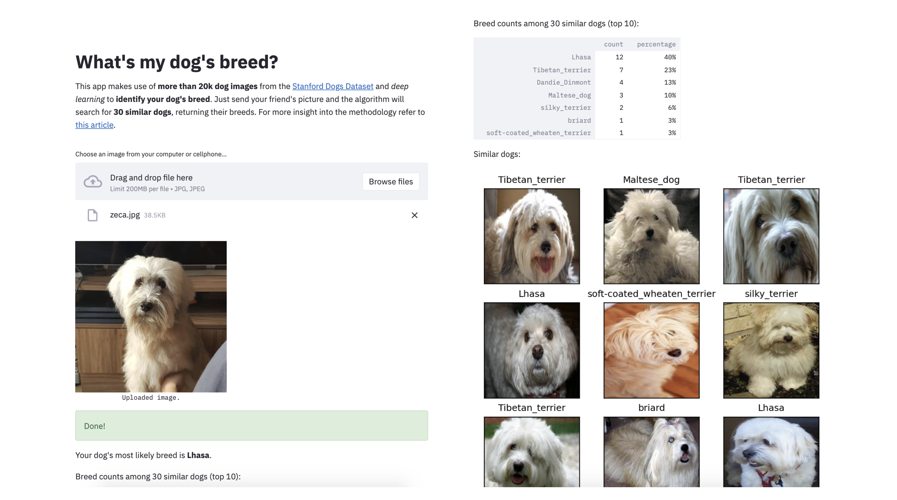

## What's my dog's breed?

This is a simple [Streamlit](https://www.streamlit.io/) app that predicts a dog's breed by searching the [Stanford Dogs Dataset](http://vision.stanford.edu/aditya86/ImageNetDogs/) for similar dogs. It is inspired by the ideas from [this blog post](https://gdmarmerola.github.io/discovering-breed-with-ml/) I wrote.

### Try it for yourself!
* [**English version**](https://share.streamlit.io/gdmarmerola/dog-breeds-app/app/app.py)
* [**Portuguese version**](https://share.streamlit.io/gdmarmerola/dog-breeds-app/app/app_portuguese_copy.py)

### How does it work?

The pipeline works by applying a bit of ***supervision*** to the feature space produced by the Xception network (pre-trained on ImageNet), producing an embedding where ***distance represents (dis)similarity in terms of dog breed***. With this specialized embedding, a 30-Nearest Neighbor model is trained, achieving comparable accuracy to a linear model trained on the original space (simple transfer learning). However, the kNN model can be much more ***interpretable and useful*** to the user as she can inspect the dog images used for the prediction.

We outline training and serving steps below.

#### Training

Training is done in the [`dog_breeds_train.ipynb`](https://github.com/gdmarmerola/dog-breeds-app/blob/master/dog_breeds_train.ipynb) notebook. It works as follows:

1. Extract features from the 20k dog images on the [Stanford Dogs Dataset](http://vision.stanford.edu/aditya86/ImageNetDogs/) using the pre-trained Xception network. The network provides a vector with 2048 features for each image.

2. Reduce features using PCA and whitening. We reduce the dimension of the image features from 2048 to 1024 features retaining 96% of the variance. We also apply whitening so the features have same scale.

3. Train a Logistic Regression on PCA output to predict breed and extract its weights. A Logistic Regression trained on PCA output scores 88% accuracy on the dataset (5-fold validation). As we applied whitening, the absolute value of its weights determines feature importance.

4. Scale features using Logistic Regression weights. We perform a "supervised transform" of the features, by doing `abs(weights) * features`. By doing this, unimportant features for predicting breed will have lower magnitude than important features. This implies that when using euclidean distance two images will mostly be compared by important features, as they will dominate the similarity metric. This works like a "custom kernel" for predicting breed.

5. Train a kNN model on the supervised feature space. As we "specialized" our feature space so distances are proportional to what features are important for predicting breed, a kNN model works like a charm, with accuracy comparable to the Logistic Regression.

6. Save artifacts. We save metadata, the kNN model and the "custom kernel" we built. We perform some tricks to avoid passing the 100MB GitHub file size limit and making the app load fast.

#### Serving

We serve the app using [Streamlit Sharing](https://www.streamlit.io/sharing), which provides a very easy-to-use integration with GitHub. When the user uploads an image, the following happens:

1. Read training artifacts. It loads metadata, the custom kernel and data for building the kNN model.

2. Read and display the image. Provides immediate feedback for the user showing the uploaded image.

3. Extract features from image. We apply the Xception network to extract features from the uploaded image.

4. Apply PCA and the custom kernel. We perform something like `abs(weights) * pca.tranform(xception_features)` so we reduce the xception feature space and scale it accoring to logistic regression weights (custom kernel).

5. Apply the kNN model. The features are now ready for the kNN model which searches for 30 similar dogs in the database.

6. Display results. The app shows the most likely breed for the uploaded dog image, breed counts among 30 similar dogs, and images of the 30 similar dogs as well.

